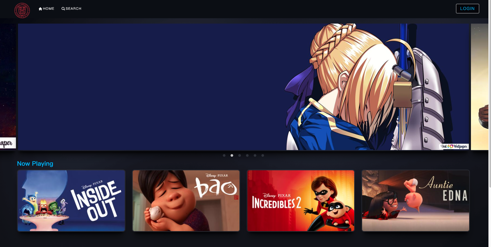
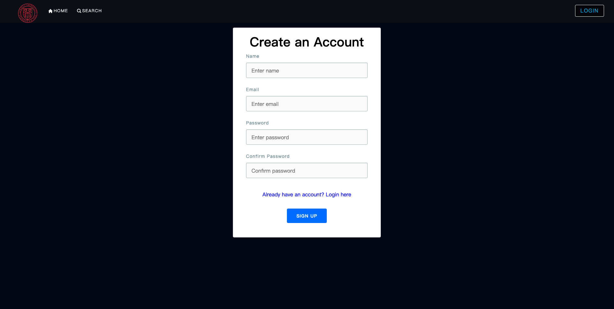
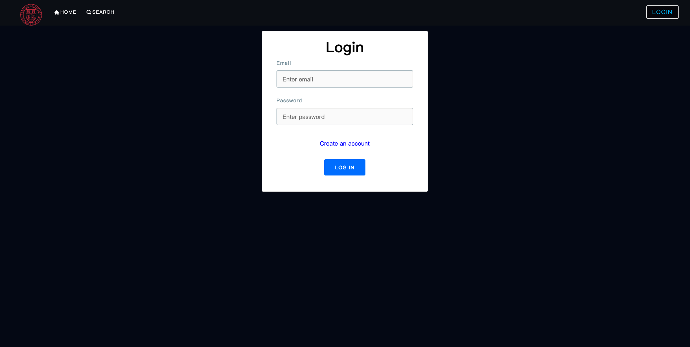
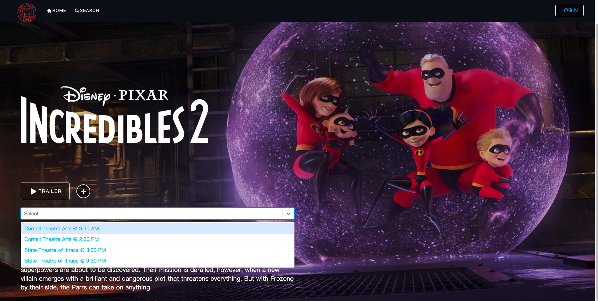
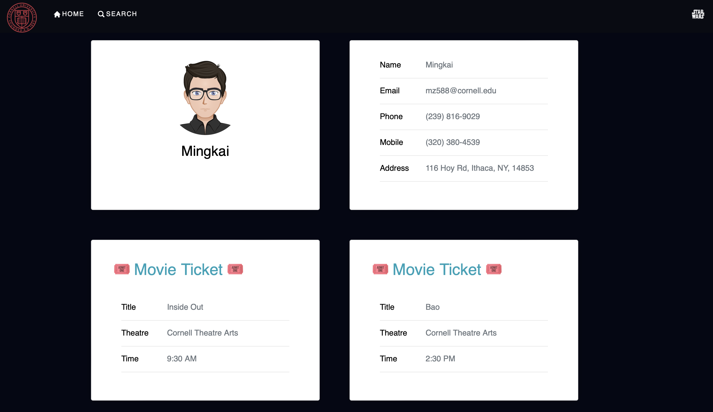
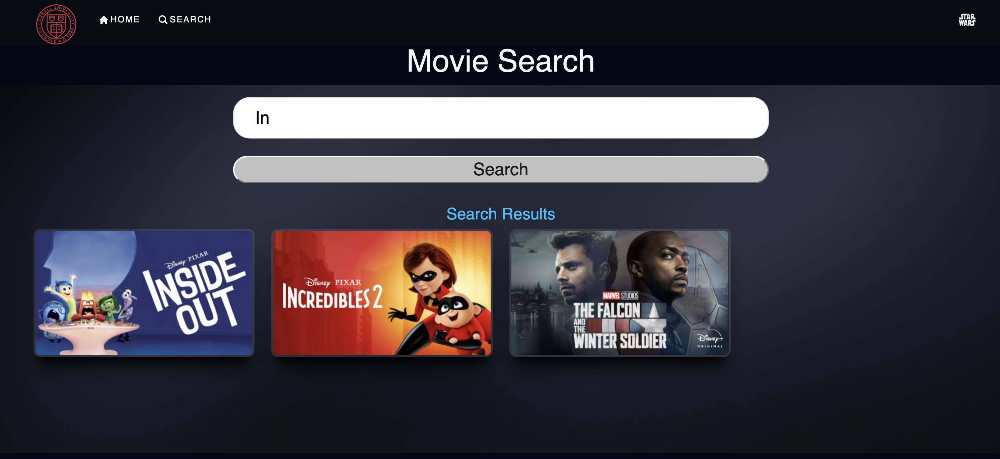

# MovieX

## Description
MovieX is a web based application that allows user to book tickets for newly released movies in theater. User can search for any movie using the search bar provided and according to their preference they can book tickets for the Movie.

## Technologies Used
* **Front-End :** *ReactJs* 
* **Load-balancing :** *Envoy proxy* 
* **Microservices communication :** *gRPC* 
* **Microservices container :** *Docker* 
* **Backend database :** *MongoDB*
* **Pakage Manager** *Node Package Manager (npm) & Preferred Installer Program (pip)*  

## Features

* you can create your Account from SignUp Page and Access the data from any device anywhere anytime.
* you can Search any Movie From the Search-bar of the application
* you can reserve tickets for movies which are currently streaming in Cinemas.
* you can check your reservation History that shows Every Details of the Reservation

## Screenshots
**1.** Home-Page of Application.

   

**2.** Sign-Up Page.
   
   

**3.** Sign-In / Login Page.
   
   

**4.** Reserve currently playing movies.
   
   

**5.** Reservation history.
   
   

**6.** Search by the movie title.
   
   

## Installation Guide

Below are the steps to follow to contribute to this project:

**1.** Fork [this](https://github.com/ashavijit/MovieX) repository.

**2.** Clone your forked copy of the project.

```
git clone https://github.com/<your_user_name>/Meetify.git
```

where `your_user_name` is your GitHub username.

**3.** Navigate to the project directory.

```
cd MovieX
```

**4.** Add a reference(remote) to the original repository.

```
git remote add upstream https://github.com/ashavijit/MovieX.git
```

**5.** Check the remotes for this repository.

```
git remote -v
```

**6.** Always take a pull from the upstream repository to your main branch to keep it at par with the main project(updated repository). Feel free to raise new issues.

```
git pull upstream main
```

**7.** Create a new branch.

```
git checkout -b <your_branch_name>
```

**8.** Make Sure Docker is installed in your Device if not please install Docker

**9.** Docker Compose build

```
$ docker-compose build
```

**10.** Docker Compose Up
```
$ docker-compose up
```
you are ready to make changes to the project

**11.** Please Change the PORT Number in the ```docker-compose.yml``` file.

**12.** fter installation, go to the URL: `http://localhost:3000/`.

**13.** Make necessary changes and commit those changes

**14.** Track your changes.

```
git add .
```

**15.** Commit your changes .

```
git commit -m "bla bla bla"
```

**16.** Push the committed changes in your feature branch to your remote repo.

```
git push -u origin <your_branch_name>
```

**17.** To create a pull request, click on `Compare & pull request`. Please ensure you compare your feature branch to the desired branch of the repo you are suppose to make a PR to.

**18.** Add appropriate title and description to your pull request explaining your changes and efforts done.

**19.** Click on `Create pull request`.

**20.** Congrats!! you are done creating a pull request to this project. 

**21.**  After this, the maintainers will review the PR and will merge it if it helps move the project forward. Otherwise, it will be given constructive feedback and suggestions for the changes needed to add the PR to the codebase.


## License

MovieX (MovieTicketReservation) is licensed under the MIT License.

[](https://github.com/ashavijit/MovieX/blob/main/LICENCE)

## Contributors

<a href="https://github.com/ashavijit/MovieX/graphs/contributors">
  
</a>

